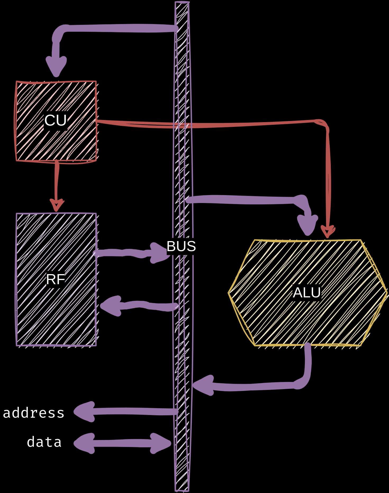

# arhitektura računara
bebić / rač @ petnica / mart 2024

---

<!-- footer: comparch / bebić / rač@petnica / mart 2024 -->
<!-- paginate: true -->

## šta je računar ?

---

### kalkulator model


---

### kalkulator model


---

### model "šalterske obrade"


---

### definicija računara 

> računar je uređaj koji **čita, obrađuje i piše** razne brojeve na različitim lokacijama, shodno ulazima i fiksnom skupu pravila za obradu tih brojeva, dokle god se ne ispuni uslov za prekid obrade.

---

### kako radi računar

1) **pročitaj broj** sa lokacije
2) **obradi broj** shodno instrukciji
3) **upiši broj** na lokaciju
4) goto 1.

---

### problem - odakle nam instrukcije ?


---

### stored-program computer


---

### problem - pristup podcima

---

### registri i RAM


---

### šta su zapravo instrukcije ?

---

### aritmetičke operacije

```
add r3, r1, r2  ; r3 = r1 + r2
sub r4, r3, r4  ; r4 = r3 - r4
```

---

### memorijske operacije

```
load r1, #10    ; r1 = mem[10]
store #12, r2   ; mem[12] = r2
```

---

### primer programa

```
load    r1, #11
load    r2, #12
add     r3, r1, r2
store   #13, r3
```

---

### <center><font color="#555">predah</font></center>

---

### a kako to zapravo radi ?

---

### šta je računar ?


---

### šta je CPU ?



---

### šta je instrukcija ?

* broj
* _program counter_

---

### primer 1

```
add r0, r1, r2

00000001 10000000
XXXMRRPP DD------ 
```

---

### primer 2

```
add r1, r1, 42

00010101 00101010
XXXMRRPP IIIIIIII
```

---

### primer 3

```
load r1, #10

11100010 00001010
XXXYYYRR AAAAAAAA
```

---

### primer 4

```
store #11, r0

11100100 00001011
XXXYYYRR AAAAAAAA
```

---

### kako rade registri ?

---

### kako radi CU ?

---

### kako radi ALU ?

---

### <center><font color="#555">predah</font></center>

---

### hajde da napravimo CPU