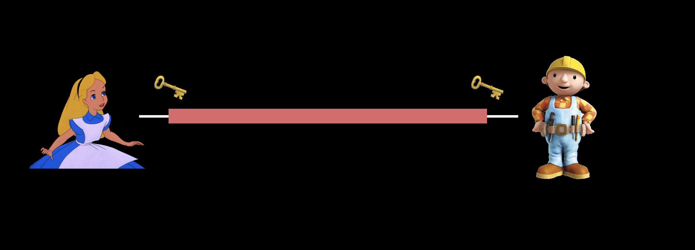
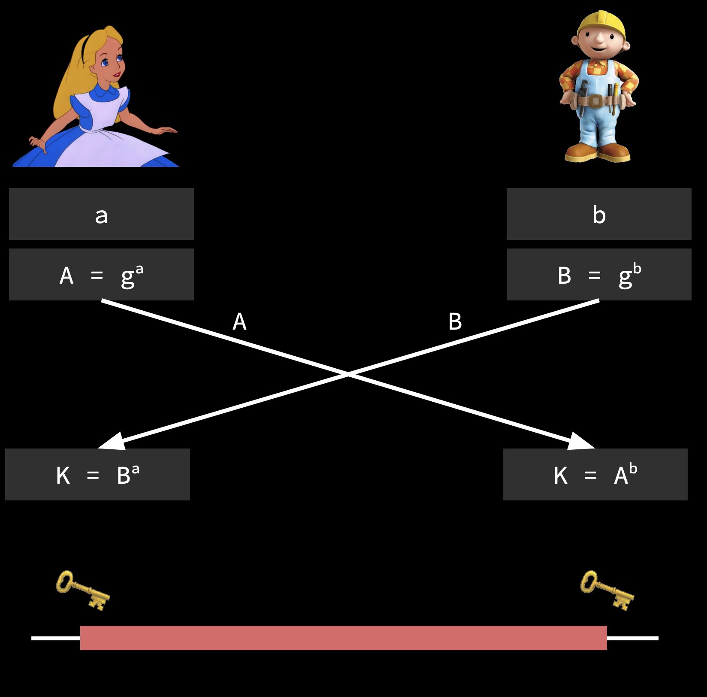
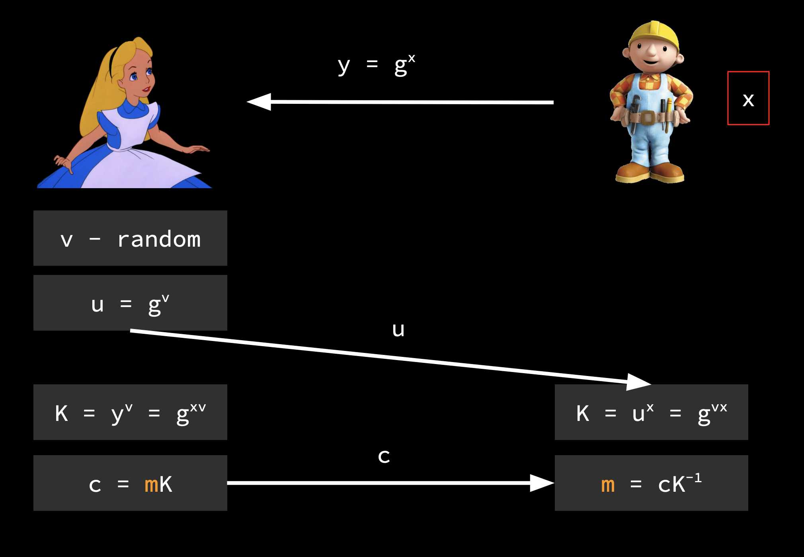
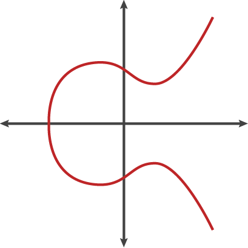
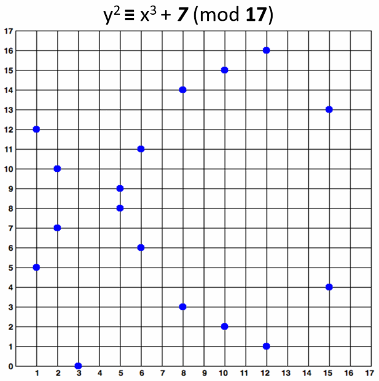

# sa Alisom u zemlji čuda

##### pavle & bebić / all @ petnica / april 2024

---

<!-- footer: sa Alisom u zemlji čuda / pavle & bebić / all@petnica / april 2024 -->
<!-- paginate: true -->

## rana kriptografija

* Glg brx hyhu khdu wkh wudjhgb ri Gduwk Sodjxhlv Wkh Zlvh? L wkrxjkw
* Did you ever hear the tragedy of Darth Plagueis The Wise? I thought

---

## cezarova šifra

* dodamo 3 na svako slovo (a -> d, b -> e, …)
* dekripcija ?
  * oduzmemo 3
* kako ovo razbiti ?
* kako ovo poboljšati ?

---

* Rakmi Hsauwtol cal a Rakq Sgkr gy mit Lomi, lg hgctkyws afr lg
* Darth Plagueis was a Dark Lord of the Sith, so powerful and so

---

## monoalfabetska substitucija

* svako slovo zamenimo nekim drugim (bez nekog redosleda)
  * oko $4*10^{26}$ kombinacija
* kako dekriptovati ?
* kako ovo razbiti ?

---

## kako razbijamo random substituciju

 UBU HSG ONOI MOEI CMO CIEPOUH SK UEICM DLEPGOBT CMO FBTO? B CMSGPMC JSC. BC'T JSC E TCSIH CMO YOUB FSGLU COLL HSG. BC'T E TBCM LOPOJU. UEICM DLEPGOBT FET E UEIX LSIU SK CMO TBCM, TS DSFOIKGL EJU TS FBTO MO VSGLU GTO CMO KSIVO CS BJKLGOJVO CMO WBUBVMLSIBEJT CS VIOECO LBKO… MO MEU TGVM E XJSFLOUPO SK CMO UEIX TBUO CMEC MO VSGLU ONOJ XOOD CMO SJOT MO VEIOU EZSGC KISW UHBJP. CMO UEIX TBUO SK CMO KSIVO BT E DECMFEH CS WEJH EZBLBCBOT TSWO VSJTBUOI CS ZO GJJECGIEL. MO ZOVEWO TS DSFOIKGL… CMO SJLH CMBJP MO FET EKIEBU SK FET LSTBJP MBT DSFOI, FMBVM ONOJCGELLH, SK VSGITO, MO UBU. GJKSICGJECOLH, MO CEGPMC MBT EDDIOJCBVO ONOIHCMBJP MO XJOF, CMOJ MBT EDDIOJCBVO XBLLOU MBW BJ MBT TLOOD. BISJBV. MO VSGLU TENO SCMOIT KISW UOECM, ZGC JSC MBWTOLK. 

* šifra: OCSBE…
* engl.: ETAOI…

---

## Kirhofovo pravilo

* šifra treba da je bezbedna, čak i ako je poznat algoritam
  * postojanje tajnog **ključa**

---

## simetrična enkripcija

---

## simetrična enkripcija

* vernam
* moderne šifre
  * dsa, aes, rc4, …
* problem: kako podeliti ključ

---

## grupe

---

## šta je grupa

* $G$ - skup
* $* : G \times G \to G$ - operacija

---

## šta je grupa

* $(a * b) * c = a * (b * c)$
* $a * e = a = e * a$ - neutral
* $a * a^{-1} = e = a^{-1} * a$ - inverz od $a$
* (Abel) $a * b = b * a$

---

## šta je grupa - konkterno

* $(\mathbb{Z}_n, +)$ - $0, 1, 2, \dotsb, n-1$
* $(\mathbb{D}_n, \circ)$ - simetrije n-tougla

---

## generatori grupe

* $\mathbb{Z}_n$ - $<\!1\!>$
* $\mathbb{D}_n$ - $<\!r, s\!>$

---

## asimetrična eknripcija

---

## discrete-log problem

* $y = g^x = \underbrace{g \cdot g \cdot ... \cdot g}_x$
* lako izračunati $y$, teško $x$
* $(g^x)^y = g^{xy} = (g^y)^x$

---

## Diffie-Hellman

* kako razmeniti ključeve

---

## Diffie-Hellman

---

## asimetrična enkripcija

* **javni ključ** - pomoću njega nam ljudi šalju poruke
* **privatni ključ** - pomoću njega samo mi možemo pročitati poslate poruke

---

# ElGamal

* **privatni ključ** - random $x$
* **javni ključ** - $y = g^x$

---

---

## ovo ne mora obavezno biti nad $\mathbb{Z}_p$

---

## eliptičke krive

---

## šta je eliptička kriva

* $y^2 = x^3 + ax + b$

---

