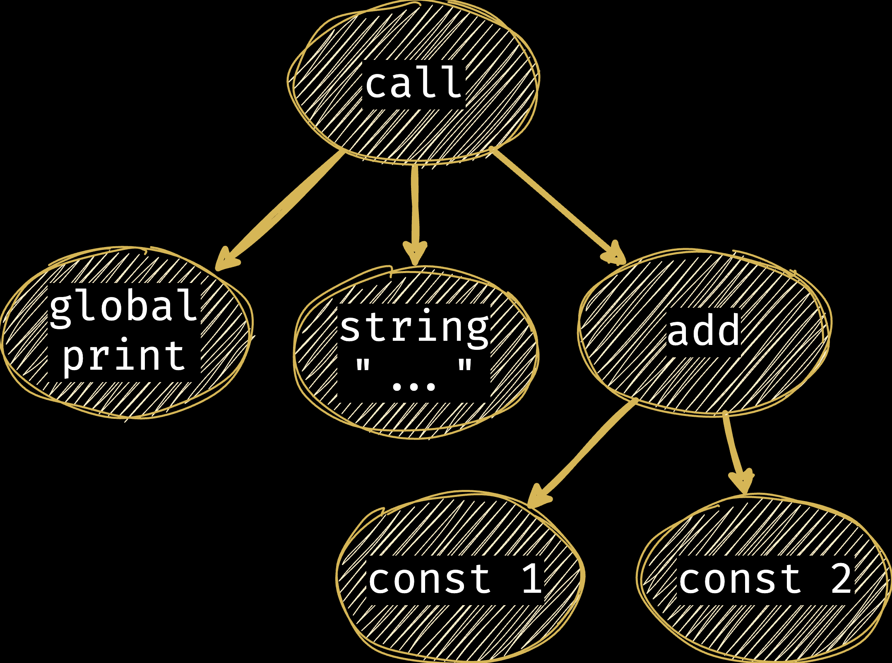

# interpreteri i kompajleri
bebić / rač @ petnica / mart 2024

---

<!-- footer: intercomp / bebić / rač@petnica / mart 2024 -->
<!-- paginate: true -->

## kako ovo radi ?

```c
// main.c

int main() {
    printf("Hello, world!\n")
    return 0;
}
```

---

## kako _ovo_ radi ?

```py
print("Hello, world!")
```

---

## šta je zapravo `python` ?

---

## kako radi interpreter ?

---

## šta je zapravo `.py` fajl ?

---

```py
print("Hello, world!")
```

je zapravo

```
112 114 105 110 116 40 34  72
101 108 108 111 44  32 119 111 
114 108 100 33  34  41
```

---

## moramo da _razumemo_ fajl

---

```py
print("Hello, world!", 1 + 2)
```

---

```py
'print' '(' '"Hello, world!"' ',' '1' '+' '2' ')'
```

---

```py
CALL
    VARIABLE 'print'
    STRING   'Hello, world!'
    ADD
        NUMBER 1
        NUMBER 2
```

---

### leksiranje

---

```java
public enum TokenType {
    IDENTIFIER, NUMBER, STRING,
    LPAREN, RPAREN, COMMA, PLUS,
    EOF
}

public class Token {
    public TokenType type;
    public String value;
}
```

---

```java
Token nextToken() {
    char currentChar = nextChar();
    if (currentChar == '(') {
        return new Token(TokenType.LPAREN, "(");
    // ...
```

---

```java
    // ...
    if (isAlpha(currentChar)) {
        String ident = "" + currentChar;
        while (isAlphaNum(peekChar())) {
            ident += nextChar();
        }
    }
    // ...
```

---

### postoje alati koji to rade za nas

---

### lex / flex

```
%%
[a-zA-Z]+    { return IDENTIFIER; }
[0-9]+       { return NUMBER; }
```

---

### parsiranje

---

```java
public Ast parseAdd() {
    Ast lhs = parseExpression();
    parseToken(TokenType.PLUS);
    Ast rhs = parseExpresion();
    
    return new AddNode(lhs, rhs);
}
```

---

### postoje alati koji to rade za nas

---

### yacc / bison

```
%%
expression
    : expression '+' expression
    | expression '-' expression
    | IDENTIFIER
    | NUMBER
    ;
```

---

### ast



---

```java
class VariableNode extends Ast {
    private String name;
}
```

---

```java
class AddNode extends Ast {
    private Ast lhs;
    private Ast rhs;
}
```

---

### šta sad ?

---

## izvršavanje

---

```java
public interface Expression {
    Object execute(Context ctx);
}
```

---

```java
// class AddNode
public Object execute(Context ctx) {
    Object lhs = this.lhs.execute(ctx);
    Object rhs = this.rhs.execute(ctx);
    
    return (double)lhs + (double)rhs;
}
```

---

### šta je `Context` ?

---

```java
public class VariableNode {
    private String name;
    
    public Object execute(Context ctx) {
        return ctx.getVariable(name);
    }
}
```

---

### kako implementiramo `if` ?

---

```java
public class IfNode {
    private Expression condition;
    private BlockNode thenBlock;
    private BlockNode elseBlock;
    
    public Object execute(Context ctx) {
        if ((boolean)condition.execute(ctx)) {
            thenBlock.execute(ctx);
        } else {
            elseBlock.execute(ctx);
        }
    }
}
```

---

### tipovi

---

## kompajleri

---

### šta je `.exe` zapravo ?

---

### kako pravimo mašinski kod ?

---

### alokacija registara

---

```java
interface Expressions {
   Register generate(Context ctx); 
}
```

---

```java
class IntConstNode extends Ast {
    private int value;
    Register generate(Context ctx) {
        Register reg = ctx.allocateRegister();
        ctx.generate("mov", reg, value);
        return reg;
    }
}
```

---

```java
class AddIntNode {
    private Expression lhs;
    private Expression rhs;
    
    Register generate(Context ctx) {
        Register lhs = this.lhs.generate(ctx);
        Register rhs = this.rhs.generate(ctx);
        ctx.generate("add", lhs, lhs, rhs);
        ctx.releaseRegister(rhs);
        return lhs;
    }
}
```

---

### primer

```c
int fac(int x) {
    if (x == 1) {
        return 1;
    } else {
        return x * fac(x - 1);
    }
}
```

---

```arm
fac:
.Lfunc_begin0:
        sub     sp, sp, #32
        stp     x29, x30, [sp, #16]
        add     x29, sp, #16
        str     w0, [sp, #8]
        ldr     w8, [sp, #8]
        subs    w8, w8, #1
        b.ne    .LBB0_2
        b       .LBB0_1
.LBB0_1:
        mov     w8, #1
        stur    w8, [x29, #-4]
        b       .LBB0_3
        // ...
```

---

```arm
        // ...
.LBB0_2:
        ldr     w8, [sp, #8]
        str     w8, [sp, #4]
        ldr     w8, [sp, #8]
        subs    w0, w8, #1
        bl      fib
        ldr     w8, [sp, #4]
        mul     w8, w8, w0
        stur    w8, [x29, #-4]
        b       .LBB0_3
.LBB0_3:
        ldur    w0, [x29, #-4]
        ldp     x29, x30, [sp, #16]
        add     sp, sp, #32
        ret
```

---

### strogo tipovanje

---

### međureprezentacija

---

### međureprezentacija - LLVM

```llvm
define i32 @fac(i32 noundef %0) {
  %2 = alloca i32, align 4
  %3 = alloca i32, align 4
  store i32 %0, ptr %3, align 4
  %4 = load i32, ptr %3, align 4
  %5 = icmp eq i32 %4, 1
  br i1 %5, label %6, label %7

6:                                                ; preds = %1
  store i32 1, ptr %2, align 4
  br label %13

7:                                                ; preds = %1
  %8 = load i32, ptr %3, align 4
  %9 = load i32, ptr %3, align 4
  %10 = sub nsw i32 %9, 1
  %11 = call i32 @fac(i32 noundef %10)
  %12 = mul nsw i32 %8, %11
  store i32 %12, ptr %2, align 4
  br label %13

13:                                               ; preds = %7, %6
  %14 = load i32, ptr %2, align 4
  ret i32 %14
}
```

---

### optimizacija

---

### npr. `common subexpression elimination`

```c
int fac2() {
    return fac(x) * fac(x);
}
```

---

### npr. `common subexpression elimination`

```c
int fac2() {
    int t = fac(x);
    return t * t;
}
```

---

<div style="text-align: center; color: darkgray;">fin</div>