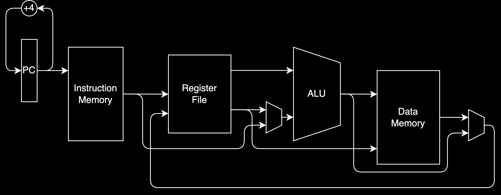
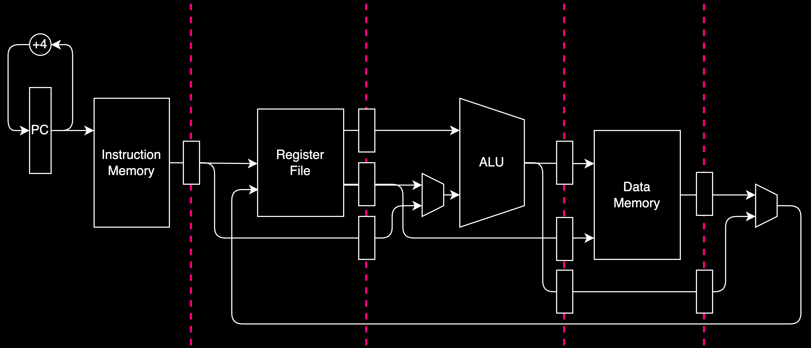
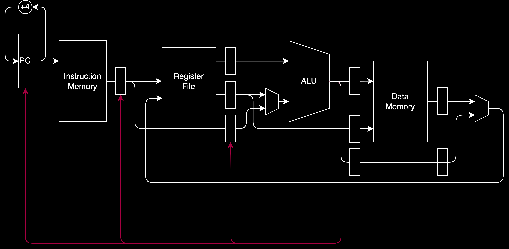

# low-level is too high-level

bebić / rač @ petnica / maj 2023

<p style="text-align: right; font-size:70%; font-weight: 100">
it started out with a CISC<br>
how did it end up like this?<br>
it was only a CISC, it was only a CISC

--- 

<!-- footer: LL is too HL / bebić / rač@petnica / maj 2023 -->
<!-- paginate: true -->

* floating point operations
* FLOPS (GFLOPS, ...)
* Intel i9-9900K (Skylake, 2018)
  * 3.30 GHz
  * how many FLOPS?
  * ≈6.5 GFLOPS


---

its_rewind_time.gif

---

## iron law

* $$\frac{\mathrm{time}}{\mathrm{program}} = \frac{\mathrm{instruction}}{\mathrm{program}}\frac{\mathrm{cycle}}{\mathrm{instruction}}\frac{\mathrm{time}}{\mathrm{cycle}}$$

---

# how does a CPU look like? 



---

problem: critical path

* longest signal path that has to complete in one cycle

---

solution: 


---

# pipeline



---

# instruction diagram

| i   | 0   | 1   | 2   | 3   | 4   | 5   | 6   | 7   | 8   |
| --- | --- | --- | --- | --- | --- | --- | --- | --- | --- |
| I1  | IF  | RF  | EX  | MEM | WB  |     |     |     |     |
| I2  |     | IF  | RF  | EX  | MEM | WB  |     |     |     |
| I3  |     |     | IF  | RF  | EX  | MEM | WB  |     |     |
| I4  |     |     |     | IF  | RF  | EX  | MEM | WB  |     |
| I5  |     |     |     |     | IF  | RF  | EX  | MEM | WB  |

---

# stage diagram

| i   | 0   | 1   | 2   | 3   | 4   | 5   | 6   | 7   | 8   |
| --- | --- | --- | --- | --- | --- | --- | --- | --- | --- |
| IF  | I1  | I2  | I3  | I4  | I5  |     |     |     |     |
| RF  |     | I1  | I2  | I3  | I4  | I5  |     |     |     |
| EX  |     |     | I1  | I2  | I3  | I4  | I5  |     |     |
| MEM |     |     |     | I1  | I2  | I3  | I4  | I5  |     |
| WB  |     |     |     |     | I1  | I2  | I3  | I4  | I5  |

---

Problem: hazards
* what if one instructions requires the result of another

---

Example

```
    a <- [1234]
    a <- a + 10
    ...
```

---

| i   | 0   | 1   | 2   | 3   | 4                           | 5                           | 6   | 7   | 8   |
| --- | --- | --- | --- | --- | --------------------------- | --------------------------- | --- | --- | --- |
| I1  | IF  | RF  | EX  | MEM | <font color="red">WB</font> |                             |     |     |     |
| I2  |     | IF  | ... | ... | ...                         | <font color="red">RF</font> | EX  | MEM | WB  |
| I3  |     |     |     |     |                             | IF                          | RF  | EX  | MEM |
| I4  |     |     |     |     |                             |                             | IF  | RF  | EX  |
| I5  |     |     |     |     |                             |                             |     | IF  | RF  |

---

| i   | 0   | 1   | 2   | 3   | 4                           | 5                           | 6   | 7   | 8   |
| --- | --- | --- | --- | --- | --------------------------- | --------------------------- | --- | --- | --- |
| IF  | I1  | I2  | ... | ... | ...                         | I3                          | I4  | I5  |     |
| RF  |     | I1  | ... | ... | ...                         | <font color="red">I2</font> | I3  | I4  | I5  |
| EX  |     |     | I1  | ... | ...                         | ...                         | I2  | I3  | I4  |
| MEM |     |     |     | I1  | ...                         | ...                         | ... | I2  | I3  |
| WB  |     |     |     |     | <font color="red">I1</font> | ...                         | ... | ... | I2  |

---

That was a data hazard.

What about control flow?

---

example:

```
  if (x != 0) goto 102
  x <- 1 + 2
  ...
102:
  ...
```
---


Solution (partial): **speculate** 
* (aka guessing but _smart_)
* Instead of stalling, introduce a _pipeline drain_.

---



---

| i    | 0   | 1   | 2                           | 3   | 4   | 5   | 6   | 7   | 8   |
| ---- | --- | --- | --------------------------- | --- | --- | --- | --- | --- | --- |
| I1   | IF  | RF  | <font color="red">EX</font> | MEM | WB  |     |     |     |     |
| I2   |     | IF  | RF                          |     |     |     |     |     |     |
| I3   |     |     | IF                          |     |     |     |     |     |     |
| I102 |     |     |                             | IF  | RF  | EX  | MEM | WB  | EX  |
| I103 |     |     |                             |     | IF  | RF  | EX  | MEM | WB  |

---

| i   | 0   | 1   | 2   | 3    | 4    | 5    | 6    | 7    | 8    |
| --- | --- | --- | --- | ---- | ---- | ---- | ---- | ---- | ---- |
| IF  | I1  | I2  | I3  | I102 | I103 |      |      |      |      |
| RF  |     | I1  | I2  | ...  | I102 | I103 |      |      |      |
| EX  |     |     | I1  | ...  | ...  | I102 | I103 |      |      |
| MEM |     |     |     | I1   | ...  | ...  | I102 | I103 |      |
| WB  |     |     |     |      | I1   | ...  | ...  | I102 | I103 |

---

<h1 style="text-align: center; color: darkgray">predah</h1>

---

Lets look at a real problem: AXPY

$$ y \leftarrow \alpha x + y$$


```c
void daxpy(double alpha, double *x, double *y, int n) {
  for (int i = 0; i < n; i++) {
    y[i] = x[i] * alpha + y[i];
  }
}
```

---

```c
void daxpy(double alpha, double *x, double *y, size_t n) {
  while (n != 0) {
    *y = (*x) * alpha + (*y);
    x++;
    y++;
    n--;
  }
}
```

---

```
    ; f1 = alpha, r1 = x, r2 = y, r3 = n
start:
    f2 <- load(r1)          ; x[i]
    f2 <- f2 * f1           ; x[i] * α
    f3 <- load(r2)          ; y[i]
    f3 <- f2 + f3           ; x[i] * α + y[i]
    store(r2) <- f3
    r1 <- r1 + 8            ; x++
    r2 <- r2 + 8            ; y++
    r3 <- r3 - 1            ; n--
    if (r3 != 0) goto start ; while (n != 0)
    return
```

---

<div>but stalling is too slow<div>

<div style="font-size: 80%">we waste way too many cycles</div>

<div style="font-size: 60%">if only we could execute instructions out of order</div>

---

lets just try it

---

RAW hazards, we don't want to wait
* pipeline is just a suggestion
* _reservation stations_

---

how will we resolve RAW hazards?
* operand tagging
* when operation completes, fill in the reservation stations

---

WAR & WAW hazards
* registers are just a suggestion
* _register renaming_

---

**physical** vs **architectural** registers
* Skylake - 180 physical registers vs 16 architectural

---

the problem of transparency
* memory is inconsistent
* exceptions are inconsistent

---

reorder buffer (ROB)
* "commit" instructions in-order

---

<div style="text-align: center; color: darkgray;">fin</div>